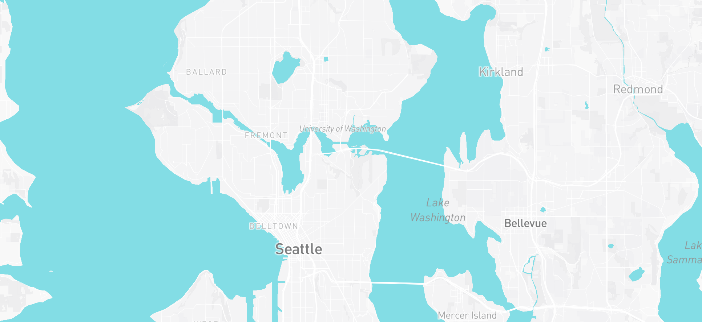
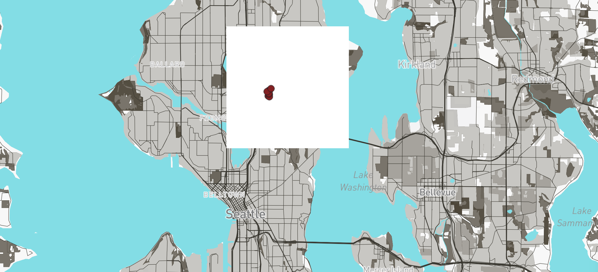
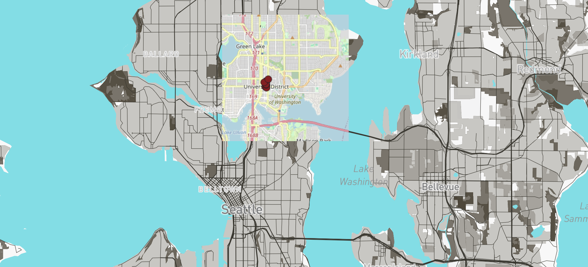
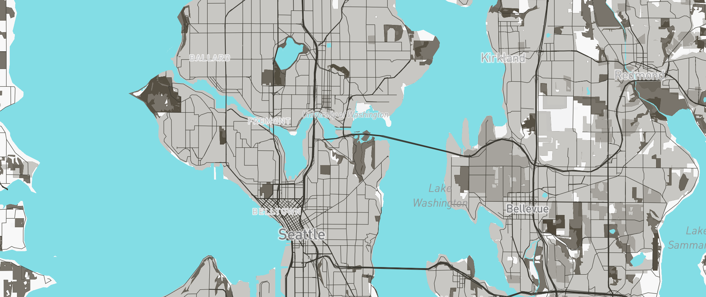

# Lab 4 – Map Design and Tile Generation

## Web Map URL
https://irving0604.github.io/geog458-lab4/

---

## Study Area
This web map focuses on the Seattle, Washington area and surrounding regions.

---

## Zoom Levels
- Tileset 1 (Basemap): 11–15  
- Tileset 2 (Thematic Dataset): 11–15  
- Tileset 3 (Combined Map): 11–15  
- Tileset 4 (Themed Map): 11–15  

---

## Tile Set Descriptions

### Tileset 1 – Basemap
A customized monochrome basemap created using Mapbox Studio and exported as raster tiles in QGIS. It provides geographic context for the study area.

### Tileset 2 – Thematic Dataset
A thematic map created from a geospatial dataset and styled in QGIS to show spatial patterns in the study area.

### Tileset 3 – Combined Map
A map combining the basemap and thematic dataset to provide both geographic context and data visualization.

### Tileset 4 – Themed Map
A themed map designed in Mapbox Studio focusing on a specific topic and using customized colors, icons, and labels.

---

## Screenshots

### Tileset 1 – Basemap

---

## Technologies Used
- QGIS  
- QMetaTiles / QTiles  
- Mapbox Studio  
- Mapbox GL JS  
- GitHub Pages
